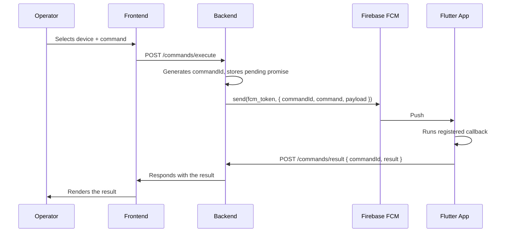

# SkyCommands

Platform for sending remote commands to Flutter devices in production and viewing the responses from a web interface. Built for diagnostics, support, and operations on already-installed apps: read/write preferences, run queries against the device's local database, force syncs, trigger one-off actions, etc.

## What it is and how it works

Three pieces that live in this monorepo under `packages/`:

- **Backend** (`packages/backend`) — HTTP API in Node.js + Express with SQLite. Maintains the device registry and dispatches commands via Firebase Cloud Messaging (FCM). [See README →](./packages/backend/README.md)
- **Flutter SDK** (`packages/flutter`) — library that integrates into the mobile app, receives commands via FCM and runs the callback the app defines. Sends the result back to the backend.
- **Frontend** (`packages/frontend`) — Vue 3 + Vite SPA where an operator authenticates, looks up devices and dispatches commands. [See README →](./packages/frontend/README.md)

### Command flow



The backend keeps the pending promise in memory until the device responds or the `timeout` expires. This means **it currently scales to a single instance**: a second replica wouldn't be able to resolve a promise created by the first.

## Stack

| Piece | Tech |
|---|---|
| Backend | Node.js 25, Express 5, SQLite (`node:sqlite`), Firebase Admin SDK, node-cron |
| Frontend | Vue 3, Vite, Vue Router, TypeScript |
| Mobile SDK | Flutter ≥ 3.19, `firebase_messaging`, `flutter_udid` |
| Infra | Docker, GitHub Actions, GHCR, SSH-based deploy |

## Repository layout

```
skycommands/
├── packages/
│   ├── backend/    # HTTP API + SQLite + FCM
│   ├── frontend/   # Vue 3 SPA
│   └── flutter/    # Client SDK for Flutter apps
├── .github/
│   └── workflows/  # CI/CD: image builds and deploys
├── package.json    # npm workspaces
└── README.md
```

## Running locally

### Requirements

- Node.js 25+ and npm.
- Environment variables defined for backend and frontend (see each package README).
- A Firebase project with Cloud Messaging enabled and the `serviceAccountKey.json` downloaded.
- Define commands in `packages/frontend/public/commands.json` (see [Command catalog](./packages/frontend/README.md#command-catalog) in the frontend README).

### Steps

1. **Install dependencies** (installs all workspaces):

   ```bash
   npm install
   ```

2. **Run**:

   ```bash
   npm run dev              # backend + frontend in parallel
   npm run dev:backend      # backend only (port 3000)
   npm run dev:frontend     # frontend only (port 5173)
   ```

3. Open [http://localhost:5173](http://localhost:5173) and log in with the credentials from the backend's `.env`.

For details specific to each piece, see the README inside each package.

## Deployment

The workflows in `.github/workflows/` (`deploy-backend.yml` and `deploy-frontend.yml`):

1. Build each Docker image on every push that touches the corresponding package.
2. Publish them to GitHub Container Registry (GHCR).
3. SSH into the server and replace the running container.

The backend mounts the `database.db` file, the Firebase credentials, and the `logs/` directory as volumes, so they survive redeploys.

Required GitHub secrets: `SSH_HOST`, `SSH_PORT`, `SSH_USERNAME`, `SSH_PASSWORD`, `TOKEN_DEPLOY`, `AUTH_USERNAME`, `AUTH_PASSWORD`, `APP_KEY`, `PORT_BACKEND`, `PORT_FRONTEND`.
